# Cruncher Deploy — Modular Docker Architecture

Public base image + post-deploy scripts for the [Cruncher](https://github.com/firmamentum/cruncher) DEX aggregation engine.

## Architecture

```mermaid
graph LR
    subgraph "Build Time (docker build, no secrets)"
        direction TB
        A["01-setup-gpu.sh<br/>CUDA 12.8 dev libs"] --> B["02-setup-system.sh<br/>apt packages, tools"]
        B --> C["03-setup-go.sh<br/>Go 1.24.0"]
        C --> D["04-setup-python-conan.sh<br/>pip3 install conan"]
        D --> E["05-setup-opencl.sh<br/>OpenCL vendor config"]
        E --> F["06-setup-postgres.sh<br/>PG server + dev headers"]
        F --> G["07-setup-redis.sh<br/>Redis + basic config"]
    end

    subgraph "Deploy Time (after token arrives)"
        direction TB
        H["08-clone-repos.sh<br/>🔑 cruncher + yireh"] --> I["09-build-deps.sh<br/>conan + go mod tidy"]
        I --> J["10-build-cruncher.sh<br/>make graph-server etc"]
        J --> K["11-setup-databases.sh<br/>DB, schema, extensions"]
        K --> L["12-setup-services.sh<br/>mgmt scripts, cron"]
    end

    G -.->|"token-watcher.sh<br/>waits for vast-ctrl"| H

    style A fill:#76b900,stroke:#4a7a00
    style H fill:#5c1a3a,stroke:#bd3a7a
```



## Quick Start

### Build

```bash
# Build the base image (local COPY mode)
docker build -t homelander0x/cruncher-base .

# Push to Docker Hub
docker push homelander0x/cruncher-base:latest
```

### Deploy on Vast.ai

1. Create a Vast.ai instance using `homelander0x/cruncher-base:latest`
2. The container boots with `token-watcher.sh` running
3. Push your GitHub token:

```bash
# Option A: SCP the token file
vast scp <instance_id> /path/to/token /root/.github_token

# Option B: HTTP POST (port 9191)
curl -X POST http://<instance_ip>:9191/token -d "ghp_your_token_here"
```

4. `repo-setup.sh` runs automatically (08 → 09 → 10 → 11 → 12)
5. Monitor progress:

```bash
# Check status
vast ssh <instance_id> "cat /root/.setup_status"

# Watch logs
vast ssh <instance_id> "tail -f /root/logs/repo-setup.log"
```

### Verify

```bash
docker run homelander0x/cruncher-base bash -c \
  "nvcc --version && go version && conan --version && psql --version && redis-cli --version"
```

## Script Reference

| # | Script | Phase | Description |
|---|--------|-------|-------------|
| 01 | `01-setup-gpu.sh` | Build | CUDA 12.8 dev libraries + env vars |
| 02 | `02-setup-system.sh` | Build | System packages, timezone, git, speedtest |
| 03 | `03-setup-go.sh` | Build | Go 1.24.0 |
| 04 | `04-setup-python-conan.sh` | Build | Conan C++ package manager |
| 05 | `05-setup-opencl.sh` | Build | OpenCL vendor configuration |
| 06 | `06-setup-postgres.sh` | Build | PostgreSQL server + dev headers |
| 07 | `07-setup-redis.sh` | Build | Redis configuration |
| — | `token-watcher.sh` | Deploy | Token listener (file poll + HTTP) |
| — | `repo-setup.sh` | Deploy | Orchestrator for steps 08–12 |
| 08 | `08-clone-repos.sh` | Deploy | Clone cruncher + yireh (needs token) |
| 09 | `09-build-deps.sh` | Deploy | Conan + Go dependency install |
| 10 | `10-build-cruncher.sh` | Deploy | Build graph-server + graphbfs-lib |
| 11 | `11-setup-databases.sh` | Deploy | PG DB/user/schema + system_stats + .env |
| 12 | `12-setup-services.sh` | Deploy | Management scripts + cron |

## Design Principles

- **Every concern is a script.** The Dockerfile is just a thin orchestrator.
- **Swap `01-setup-gpu.sh` for ROCm** and nothing else changes (future).
- **No secrets at build time.** The image is public on Docker Hub.
- **Idempotent.** Every deploy-time script uses marker files — re-running skips completed steps.
- **Each build-time script is a separate `RUN` layer.** Docker caches them independently.

## Updating Scripts

To update an individual script without rebuilding the entire image:

```bash
# 1. Edit the script locally
# 2. Push to GitHub
# 3. Rebuild (Docker cache handles unchanged layers)
docker build -t homelander0x/cruncher-base .
docker push homelander0x/cruncher-base:latest
```

For deploy-time scripts (08–12), you can update them on a running container:

```bash
# Re-download a script on a running instance
curl -fsSL https://raw.githubusercontent.com/firmamentum/deploy/main/scripts/12-setup-services.sh \
  -o /usr/local/bin/deploy/12-setup-services.sh && chmod +x /usr/local/bin/deploy/12-setup-services.sh

# Remove the marker to re-run
rm /root/.setup_done_12

# Re-run
/usr/local/bin/deploy/repo-setup.sh
```
